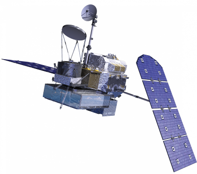
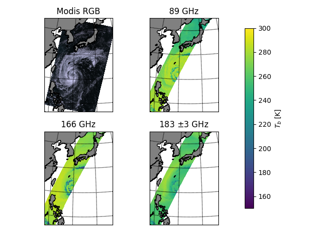

This repository contains the second exercise for the PhD course in inverse theory. It can be retrieved from [<http:github.com/simonpf/inversion_theory/>].

```bash
git clone https://github.com/simonpf/inversion_theory
```


# Repository Structure

-   `exercise_b.py`: The python exercise template. This should be a good starting point if you are planning to do the exercise in python.
-   `exercise_b.m`: The matlab exercise template. This should be a good starting point if you are planning to do the exercise in Matlab.
-   `data/`: Subdirectory containing the data for building and evaluating the retrieval.
-   `utils/`: Subdirectory containing additional python code, that is not of interest for solving the exercise.


# Background and Summary

In this exercise you will retrieve the *integrated ice column density* or *ice water path* (IWP) from passive microwave observations from the *Global Preciptiation Measurement* (GPM) *Microwave Imager*. Buehler et al. <sup><a id="fnr.1" class="footref" href="#fn.1">1</a></sup> argue that measuring the bulk mass of ice in the atmosphere constitutes an important gap in the current global climate observation system, which leads to large differences in the IWP estimates of climate models. Retrieving IWP from passive microwave sensors provides global coverage at a much higher frequency than can be achieved with active sensors. Compared to LIDAR observations, microwave observations also have the advantage of being able to penetrate through thick clouds.




# Methods

The measurement of cloud properties from passive microwave observations is based on the interaction of thermal microwave radiation with the clouds through scattering. While possible, modeling scattering in a radiative transfer model is computationally too costly to be performed *during* the retrieval. In this exercise we are therefore considering two methods that use a *precomputed* database <sup><a id="fnr.2" class="footref" href="#fn.2">2</a></sup> consisting of pairs \(\{(\mathbf{y}_i, x_i)\}^n_{i = 1}\) of simulated brightness temperatures \(\mathbf{y}_i\) and corresponding IWP values \(x_i\). The ensemble of atmospheric states from which the database is computed, was generated from profiles of ice water content obtained from the DARDAR<sup><a id="fnr.3" class="footref" href="#fn.3">3</a></sup> dataset. This is to ensure that the ensemble follows a physically meaningful a priori distribution.


## Bayesian Monte Carlo Integration

The basic idea of *Bayesian Monte Calo Integration* (BMCI) or simply *Monte Carlo Integration* as a retrieval method is to use importance sampling to transform samples from the a priori distribution to samples from the posterior distribution.

Consider the expected value \(\mathcal{E}_{x | \mathbf{y}}(f(x))\) of a function \(f\) computed with respect to the a posteriori distribution \(p(x | \mathbf{y})\):

\begin{align}
 \int f(x') p(x' | \mathbf{y}) \: dx'
\end{align}

Using Bayes theorem, the integral can be computed as

\begin{align}
 \int f(x') p(x' | \mathbf{y}) \: dx' &=
\int f(x') \frac{p(\mathbf{y} | x')p(x')}{\int p(\mathbf{y} | x'') \: dx''} \: dx'
\end{align}

To simplify notation, we introduce the weighting function \(w(\mathbf{y}, x)\) :

\begin{align}
  w(\mathbf{y}, x) = \frac{p(\mathbf{y} | x')}{\int p(\mathbf{y} | x'') \: dx''}
\end{align}

Note that the second integral in (2) is just the expectation value \(\mathcal{E}_x\{f(x)w(\mathbf{y}, x)\}\) of the function \(f\) weighted with the weighting function \(w(\mathbf{y}, x)\) but with respect to the a priori distribution. The integral in (1) can thus be approximated by a sum of \(f(x_i)w(\mathbf{y}, x_i)\) over a simulation database, which is distributed according to the a priori distribution \(p(x)\):

\begin{align}
 \int f(x') p(x' | \mathbf{y}) \: dx' \approx \sum_{i = 1}^n f(\mathbf{x}_i) w(\mathbf{y}, x_i)
\end{align}


### The Weighting Function

Assuming that our forward model simulations \((\mathbf{y}_i, x_i)\) are exact up to a zero-mean, Gaussian error with covariance matrix \(\mathbf{S}_e\), weights are given by

\begin{align}
  w(\mathbf{y}, x_i) = \frac{1}{C} \cdot \exp \left \{ 
  - \frac{(\mathbf{y} - \mathbf{y}_i)^T \mathbf{S}_e^{-1} (\mathbf{y} - \mathbf{y}_i)}
    {2} \right \}
\end{align}

for some normalization factor \(C\). The normalization factor is found to be \(C = \sum_{n = 1}^n w(\mathbf{y}, x_i)\) to ensure that \(\mathcal{E}_{x|\mathbf{y}}\{1\} = 1\).


### The Retrieval

The above approach can be used to retrieve various statistics of the posterior distribution. The most basic are the mean and the variance:

\begin{align}
 \bar{x} = \mathcal{E}_{x | \mathbf{y}} \{ x \} & \approx \sum_{i = 1}^n w(\mathbf{y}, x_i) x_i \\
\text{var}(x) = \mathcal{E}_{x | \mathbf{y}} \{ (x - \bar{x})^2 \} & \approx 
 \sum_{i = 1}^n w(\mathbf{y}, x_i) (x_i - \mathcal{E}_{x | \mathbf{y}}\{x\})^2
\end{align}

But it is even possible to approximate the cumulative distribution function of the a posteriori distribution using:

   \begin{align}
F_{x | \mathbf{y}}(x') &=  \int_{-\infty}^{x'} p(x) \: dx \\
                       &= \mathcal{E}_{x | \mathbf{y}} \{ \mathbf{I}_{x < x'} \} \\
                       &\approx \sum_{x_i < x'} w(\mathbf{y}, x_i)
   \end{align}


## Regression Methods


# Exercises

The simulation database for this exercise consists of 350000 pairs \((\mathbf{y}_i, x_i)\) of simulated brightness temperatures \(\mathbf{y}_i\) and corresponding ice water path values \(x_i\). The vector \(\mathbf{y}\) contains the brightness temperatures of channels \(8, 9, 10, 11, 12, 13\) of the GMI radiometer. For this exercise we will assume that the only uncertainty in our simulation database is due to thermal noise in the receiver.

| Channel | Center freq \([GHz]\) | Polarization | NEDT (K) |
|------- |--------------------- |------------ |-------- |
| 8       | \( 89\)               | V            | 0.32     |
| 9       | \( 89\)               | H            | 0.31     |
| 10      | \(166\)               | V            | 0.7      |
| 11      | \(166\)               | H            | 0.65     |
| 12      | \(183.31 \pm 3\)      | V            | 0.56     |
| 13      | \(183.31 \pm 7\)      | H            | 0.47     |


## BMCI

1.  The Database

    Plot the distribution of ice water path values in the database. What is the range of IWP values? What is the reason for the bimodal character of the distribution?

2.  Basic Implementation

    Write a function
    
    ```bash
    bmci(y_database, x_database, s_o, y)
    ```
    
    where
    
    -   `y_database`: Matrix containing the simulated observations along its rows.
    -   `x_database`: Vetor containing the corresponding IWP values
    -   `s_o`: Matrix containing the covariance matrix \(\mathbf{S}_o\) describing the observation uncertainty
    -   `y`: The observations for which to retrieve the ice water path. Given either as a vector (for a single inversion) or as a matrix with the observations along its rows.
    
    The method should return two vectors containing the expected values and standard deviations of the posterior distributions corresponding to the observations given in `y`.

3.  Error Analysis

    Compute and plot the *mean absolute precentege error* (MAPE)
    
    \begin{align}
     MAPE = \frac{100\%}{n} \sum_{i = 1}^n \frac{|\hat{x}(\mathbf{y}_i) - x_i|}{x_i}
    \end{align}
    
    as a function of \(x_i > 0\) for the simulated measurements \(\mathbf{y}_i, x_i\) contained in the validation data files `y_val` and `x_val`.
    
    Compute and plot also the mean of the estimated standard deviation of the posterior distribution as a function of \(x_i\).
    
    What does this tell you about the retrieval?

4.  Retrieving the Posterior CDF

    Write a function that retrieves the cumulative distribution function of the posterior.

5.  Apply your Retrieval

    The file `data/tbs_gmi` contains the observerd calibrated brightness temperatures from the (extra-)tropical storm Saola as it tracked southeast of Japan 2017-10-27.
    
    
    
    Use your retrieval to retrieve the IWP path from the brightness temperatures. You can use the function `plot_iwp` to plot your results onto the map and compare with the MODIS image.


## Regression Techniques

In this part of the exercise you should use your favorite regression method to build an alternative IWP retrieval. In case you are unsure what to pick, two method that should work relatively well more or less right away are *neural networks* or *regression trees*.

If you're using python, you may have a look at the *scikit-learn* examples for [(boosted) decision trees](http://scikit-learn.org/stable/auto_examples/ensemble/plot_adaboost_regression.html) or [neural networks](http://scikit-learn.org/stable/modules/neural_networks_supervised.html).

For matlab examples can be found [for neural networks](https://se.mathworks.com/help/nnet/examples/train-a-convolutional-neural-network-for-regression.html) and [regression trees](https://se.mathworks.com/help/stats/regressiontree-class.html), as well.

1.  Comparison to BMCI

## Footnotes

<sup><a id="fn.1" class="footnum" href="#fnr.1">1</a></sup> Simulations performed and kindly provided by Bengt Rydberg.

<sup><a id="fn.2" class="footnum" href="#fnr.2">2</a></sup> Buehler, S. A., Östman, S., Melsheimer, C., Holl, G., Eliasson, S., John, V. O., Blumenstock, T., Hase, F., Elgered, G., Raffalski, U., Nasuno, T., Satoh, M., Milz, M., and Mendrok, J.: A multi-instrument comparison of integrated water vapour measurements at a high latitude site, Atmos. Chem. Phys., 12, 10925-10943, <https://doi.org/10.5194/acp-12-10925-2012>, 2012.

<sup><a id="fn.3" class="footnum" href="#fnr.3">3</a></sup> <http://www.icare.univ-lille1.fr/projects/dardar>
